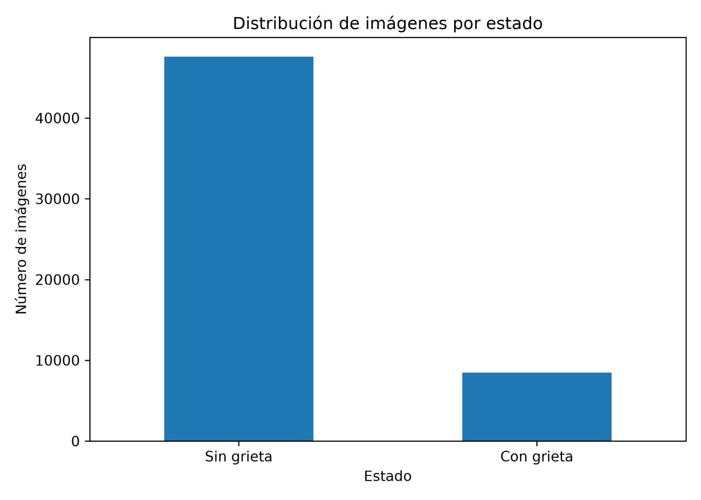
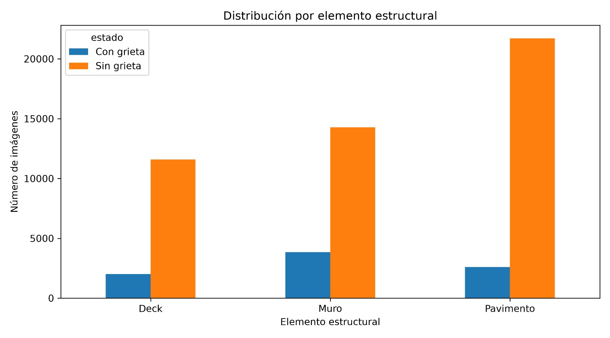

# 📑 INFORME DE TRABAJO N° 2
### **Tema:** Análisis Exploratorio y Plan Algorítmico

**Presentado por:**
* 👤 **Susana Abigail Campos Rodríguez**
* 👤 **Carlos Teodoro Barreda Guzmán**
* 👤 **Jaime Jesus Ramírez Elera**
* 👤 **Renzo Salleres Untiveros**

---

# 📊 TAREA 2: ANÁLISIS EXPLORATORIO Y PLAN ALGORÍTMICO

## **I. Análisis Exploratorio de Datos (EDA)
### **Objetivo:** Verificar la calidad de los datos y definir los modelos de ML/IA a implementar.

El desarrollo de esta etapa se centra en el **Análisis Exploratorio de Datos (EDA)**, la limpieza de las imágenes, el manejo de valores nulos y la visualización inicial de la data utilizando librerías fundamentales de Python como `Pandas`, `Matplotlib` y `PIL`.

---

## 🛠️ 1.1. Limpieza y Preprocesamiento

Para automatizar la auditoría de calidad del dataset **SDNET2018**, se implementó un script en Python que realiza las siguientes funciones:
1. **Verificación de Estructura:** Comprobación de la existencia de las subcarpetas del dataset (`DECK`, `MURO`, `PAVIMENTO`).
2. **Validación de Integridad:** Apertura de cada imagen mediante `PIL` para detectar y descartar archivos corruptos (`UnidentifiedImageError`).
3. **Mapeo de Etiquetas:** Clasificación binaria (0: Sin grieta, 1: Con grieta) y segmentación por elemento estructural.
4. **Normalización Visual:** Conversión forzada a tres canales **RGB** y reescalado uniforme a una resolución de **256 x 256 píxeles**.

> ⚠️ **Nota de Infraestructura:** El script genera un nuevo directorio optimizado llamado `SDNET2018_LIMPIO`, aislando los datos corruptos y guardando un inventario consolidado en un archivo `.csv` para asegurar la **Computabilidad** del modelo.

---

## 📈 1.2. Resultados del Análisis Exploratorio (EDA)

Luego de ejecutar nuestro pipeline sobre el volumen total de datos, se obtuvieron las siguientes métricas de control de calidad:

### 📋 Cuadro de Control y Valores Nulos
| Métrica Evaluada | Cantidad Registrada | Observación / Estado |
| :--- | :---: | :--- |
| **Imágenes Originales Válidas** | *[56092]* | Listas para el preprocesamiento |
| **Imágenes Corruptas Detectadas** | *[0]* | Removidas del conjunto activo |
| **Valores Nulos Detectados (Missing)**| `0` | Base de datos limpia sin vacíos |

### 🗂️ Distribución de Imágenes por Estado (Balance de Clases)
| Estado de la Superficie | Código de Carpeta | N° de Imágenes | Porcentaje (%) |
| :--- | :---: | :---: | :---: |
| 🔴 **Con Grieta (Cracked)** | CD / CW / CP | *[8484]* | *[84.87%]* |
| 🟢 **Sin Grieta (Uncracked)** | UD / UW / UP | *[47608]* | *[15.13%]* |

### 🏗️ Segmentación por Elemento Estructural
| Elemento Estructural | Con Grieta (1) | Sin Grieta (0) | Total por Elemento |
| :--- | :---: | :---: | :---: |
| 🌉 **Tablero de Puente (Deck)** | *[2025]* | *[11595]* | *[13620]* |
| 🧱 **Muro (Wall)** | *[2608]* | *[21726]* | *[24334]* |
| 🛣️ **Pavimento (Pavement)** | *[3851]* | *[14287]* | *[18138]* |

---

## 🖼️ 1.3. Reportes Gráficos del Dataset

*Los siguientes diagramas estadísticos fueron generados automáticamente mediante `Matplotlib` y reflejan las proporciones estructurales del dataset:*

| Distribución por Carpetas | Balance de Clases (Estado) | Análisis por Elemento |
| :---: | :---: | :---: |
|  |  |  |

*(Nota: Asegúrate de arrastrar y soltar los archivos `.png` de tus gráficos dentro de la carpeta de GitHub para que las imágenes de arriba carguen correctamente).*

## 🐍 4. Código Fuente de la Implementación (Python)
| Descripción... | Enlace |
| :--- | :--- |
| **Ver o ejecutar el script de limpieza completo (Python)** | [TAREA2.PY](./TAREA2.PY) |
| **Revisar el reporte y la documentación del análisis** | [TAREA 2.md](./TAREA%202.md) |


## 🏗️ PLAN DE ALGORITMO
## Detección de Fisuras en Superficies de Concreto mediante una CNN

## 📌 Descripción del proyecto

El presente proyecto propone el desarrollo de un modelo de **visión artificial** basado en una **Red Neuronal Convolucional (CNN)** para detectar automáticamente la presencia o ausencia de fisuras visibles en superficies de concreto.

Para el entrenamiento y evaluación del modelo se utilizará el dataset **SDNET2018**, compuesto por imágenes de superficies de concreto con y sin presencia de fisuras.

El problema será abordado como una tarea de **clasificación binaria**, en la cual cada imagen será clasificada en una de las siguientes categorías:

* 🔴 **Con fisura (`Cracked`)**
* 🟢 **Sin fisura (`Uncracked`)**

La finalidad del proyecto es contribuir a la automatización de la inspección visual de estructuras de concreto mediante técnicas de **Deep Learning** y **visión por computadora**.

---

## 🎯 1. Objetivo del proyecto

> **Desarrollar un modelo de visión artificial basado en una Red Neuronal Convolucional (CNN) para detectar y clasificar automáticamente la presencia o ausencia de fisuras visibles en superficies de concreto, utilizando imágenes del dataset SDNET2018.**

---

## 🧠 2. Red Neuronal Convolucional (CNN)

La **Red Neuronal Convolucional (CNN)** será utilizada como modelo principal de **aprendizaje supervisado** para realizar la clasificación binaria de las imágenes.

Las CNN son especialmente adecuadas para el procesamiento de imágenes debido a su capacidad para aprender automáticamente características visuales relevantes durante el proceso de entrenamiento.

Entre las características que el modelo puede aprender se encuentran:

* Bordes.
* Texturas.
* Contornos.
* Formas.
* Patrones espaciales.
* Características visuales asociadas con la presencia de fisuras.

### 📥 Variables de entrada

Las variables de entrada estarán constituidas por la información visual contenida en las imágenes, incluyendo:

* Valores de intensidad de los píxeles RGB.
* Textura superficial.
* Bordes y contornos.
* Forma y orientación de las fisuras.
* Contraste.
* Iluminación.
* Ruido visual.

### 📤 Variable de salida

La variable de salida será de tipo binario:

|    Clase    | Descripción                                       |
| :---------: | :------------------------------------------------ |
|  `Cracked`  | 🔴 Superficie de concreto con presencia de fisura |
| `Uncracked` | 🟢 Superficie de concreto sin presencia de fisura |

---

## 🔍 3. Justificación del uso de una CNN

La elección de una **Red Neuronal Convolucional (CNN)** se justifica porque las fisuras presentan patrones espaciales y geométricos que pueden variar considerablemente en:

* Forma.
* Orientación.
* Longitud visible.
* Contraste.
* Apariencia superficial.

Asimismo, las imágenes del dataset **SDNET2018** pueden contener condiciones visuales complejas, como:

* Sombras.
* Rugosidad superficial.
* Bordes.
* Agujeros.
* Residuos de fondo.
* Variaciones de iluminación.

METRICAS.

| Métrica                   | ¿Qué mide?                                                                                  | Objetivo                                         |
| ------------------------- | ------------------------------------------------------------------------------------------- | ------------------------------------------------ |
| **Accuracy (Exactitud)**  | Porcentaje total de imágenes clasificadas correctamente.                                    | Lo más cercano posible al 100%.                  |
| **Precision (Precisión)** | De todas las imágenes que el modelo predijo como "Fisura", cuántas realmente tenían fisura. | Evitar falsos positivos.                         |
| **Recall (Sensibilidad)** | De todas las imágenes que realmente tenían fisura, cuántas fueron detectadas.               | Evitar falsos negativos.                         |
             |
         |
| **Loss (Pérdida)**        | Error calculado durante el entrenamiento.                                                   | Debe disminuir conforme avanza el entrenamiento. |

---

## 🔄 4. Flujo general propuesto

```text
┌─────────────────────────────────────────┐
│          IMAGEN DE CONCRETO             │
└────────────────────┬────────────────────┘
                     │
                     ▼
┌─────────────────────────────────────────┐
│            PREPROCESAMIENTO             │
│                                         │
│  • Redimensionamiento                   │
│  • Normalización                        │
│  • Aumento de datos                     │
└────────────────────┬────────────────────┘
                     │
                     ▼
┌─────────────────────────────────────────┐
│     RED NEURONAL CONVOLUCIONAL (CNN)    │
└────────────────────┬────────────────────┘
                     │
                     ▼
┌─────────────────────────────────────────┐
│          CLASIFICACIÓN BINARIA          │
└───────────────┬─────────────┬───────────┘
                │             │
                ▼             ▼
        ┌─────────────┐ ┌─────────────┐
        │ CON FISURA  │ │ SIN FISURA  │
        │  (Cracked)  │ │ (Uncracked) │
        └─────────────┘ └─────────────┘
```

---

## ⚙️ 5. Preprocesamiento de las imágenes

Antes de ingresar las imágenes a la **CNN**, se realizará una etapa de preprocesamiento con la finalidad de preparar y estandarizar los datos.

Las principales operaciones consideradas son:

### 🔹 Redimensionamiento

Todas las imágenes serán ajustadas a un tamaño uniforme compatible con la arquitectura de la red neuronal.

### 🔹 Normalización

Los valores de los píxeles serán normalizados para facilitar el proceso de entrenamiento del modelo.

### 🔹 Aumento de datos (*Data Augmentation*)

Se podrán aplicar transformaciones controladas a las imágenes de entrenamiento, tales como:

* Rotaciones.
* Desplazamientos.
* Volteo horizontal.
* Variaciones de escala.

Estas técnicas permitirán aumentar la diversidad de los datos de entrenamiento y mejorar la capacidad de generalización del modelo.

---

## 📊 Métricas que se utilizarán para evaluar el éxito del modelo

Para evaluar el desempeño de la **Red Neuronal Convolucional**, se utilizarán diferentes métricas de clasificación.

### 🎯 Accuracy — Exactitud

Mide el porcentaje total de imágenes clasificadas correctamente.

```text
Accuracy = Predicciones correctas / Total de predicciones
```

---

### 🔎 Precision — Precisión

Mide qué proporción de las imágenes clasificadas por el modelo como **“Con fisura”** realmente presentan una fisura.

Una precisión alta indica una menor cantidad de **falsos positivos**.

---

### 🚨 Recall — Sensibilidad

Mide qué proporción de las imágenes que realmente presentan fisuras fueron correctamente identificadas por el modelo.

Esta será una de las métricas de mayor importancia para el proyecto, debido a que permite evaluar la capacidad del modelo para **detectar fisuras existentes**.

Un valor bajo de `Recall` implicaría que algunas imágenes con fisuras podrían ser clasificadas incorrectamente como **“Sin fisura”**.

---

### ⚖️ F1-Score

El **F1-Score** representa un equilibrio entre `Precision` y `Recall`.

Esta métrica será útil para evaluar el rendimiento global del modelo, especialmente cuando se requiera considerar simultáneamente los falsos positivos y los falsos negativos.

---

### 🧩 Matriz de confusión

La matriz de confusión permitirá visualizar los resultados de clasificación mediante:

| Resultado                   | Descripción                                   |
| :-------------------------- | :-------------------------------------------- |
| **Verdadero Positivo (TP)** | Imagen con fisura correctamente identificada  |
| **Verdadero Negativo (TN)** | Imagen sin fisura correctamente identificada  |
| **Falso Positivo (FP)**     | Imagen sin fisura clasificada como con fisura |
| **Falso Negativo (FN)**     | Imagen con fisura clasificada como sin fisura |

> [!IMPORTANT]
> En el contexto de inspección de superficies de concreto, se prestará especial atención a los **falsos negativos**, debido a que representan fisuras existentes que el modelo no logró detectar.

---

## ✅ 7. Criterios de éxito del modelo

El desempeño del modelo será evaluado mediante las métricas obtenidas sobre un conjunto de imágenes que no hayan sido utilizadas durante el entrenamiento.

Como criterios iniciales de referencia, se propone evaluar:

| Métrica       | Criterio de referencia |
| :------------ | :--------------------: |
| **Accuracy**  |         ≥ 90 %         |
| **Precision** |         ≥ 90 %         |
| **Recall**    |         ≥ 90 %         |
| **F1-Score**  |         ≥ 0.90         |

> [!NOTE]
> Estos valores corresponden a **criterios iniciales propuestos para evaluar el desempeño del modelo** y no representan resultados obtenidos. Los valores finales serán determinados después del entrenamiento y evaluación de la CNN.

---

## 📚 8. Dataset

El proyecto utilizará el dataset **SDNET2018**, compuesto por imágenes de superficies de concreto utilizadas para el estudio y detección de fisuras.

Para este proyecto, las imágenes serán organizadas en dos categorías principales:

```text
dataset/
│
├── Cracked/
│   ├── imagen_001.jpg
│   ├── imagen_002.jpg
│   └── ...
│
└── Uncracked/
    ├── imagen_001.jpg
    ├── imagen_002.jpg
    └── ...
```

Posteriormente, los datos serán divididos en conjuntos de:

* **Entrenamiento (`Training`)**
* **Validación (`Validation`)**
* **Prueba (`Test`)**

El conjunto de prueba permitirá realizar la evaluación final del modelo con imágenes no utilizadas durante el proceso de entrenamiento.

---

## 🛠️ 9. Tecnologías propuestas

El proyecto contempla el uso de las siguientes tecnologías:

* 🐍 **Python**
* 🧠 **Redes Neuronales Convolucionales (CNN)**
* 👁️ **Visión por computadora**
* 🤖 **Deep Learning**
* 📊 **Machine Learning**
* 🖼️ **Procesamiento de imágenes**
* 📚 **Dataset SDNET2018**

---


## 📌 Resultado esperado

Se espera obtener un modelo de clasificación capaz de recibir una imagen de una superficie de concreto y determinar automáticamente si presenta o no una fisura visible.

```text
              IMAGEN DE ENTRADA
                     │
                     ▼
              ┌─────────────┐
              │     CNN     │
              └──────┬──────┘
                     │
             ┌───────┴───────┐
             ▼               ▼
        CON FISURA       SIN FISURA
         (Cracked)       (Uncracked)
```

El modelo será evaluado mediante **Accuracy, Precision, Recall, F1-Score y Matriz de Confusión**, permitiendo determinar cuantitativamente su capacidad para identificar fisuras visibles en superficies de concreto.


  
