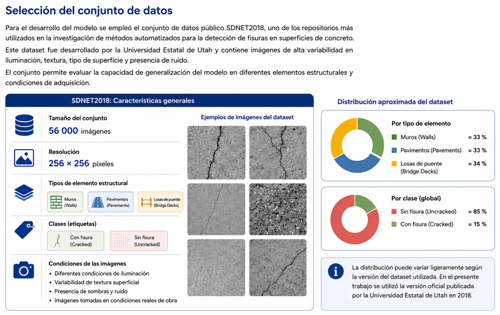
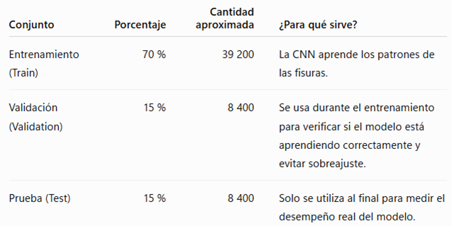
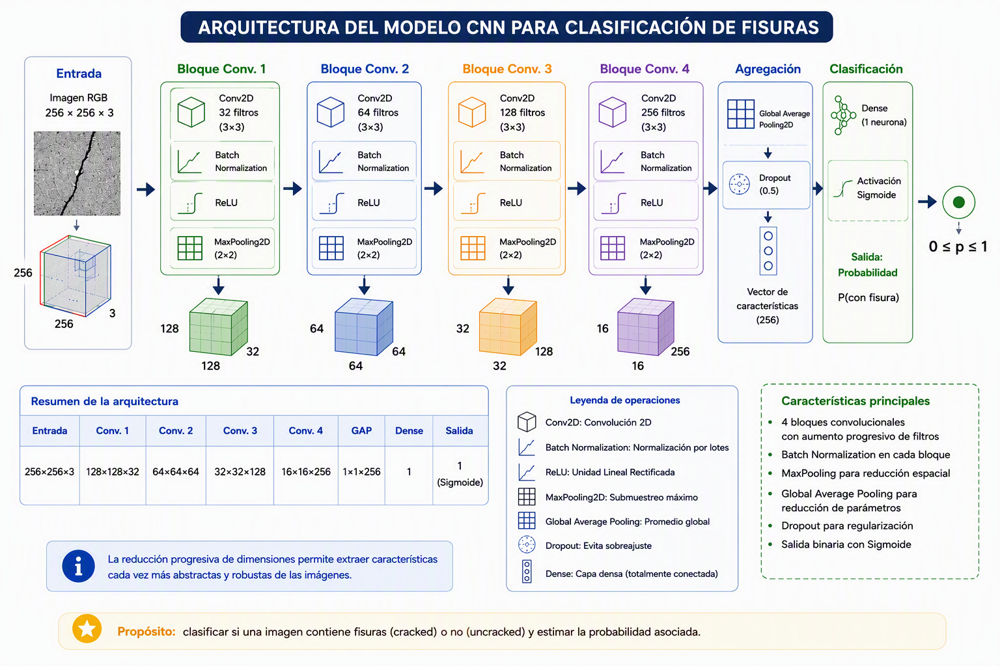
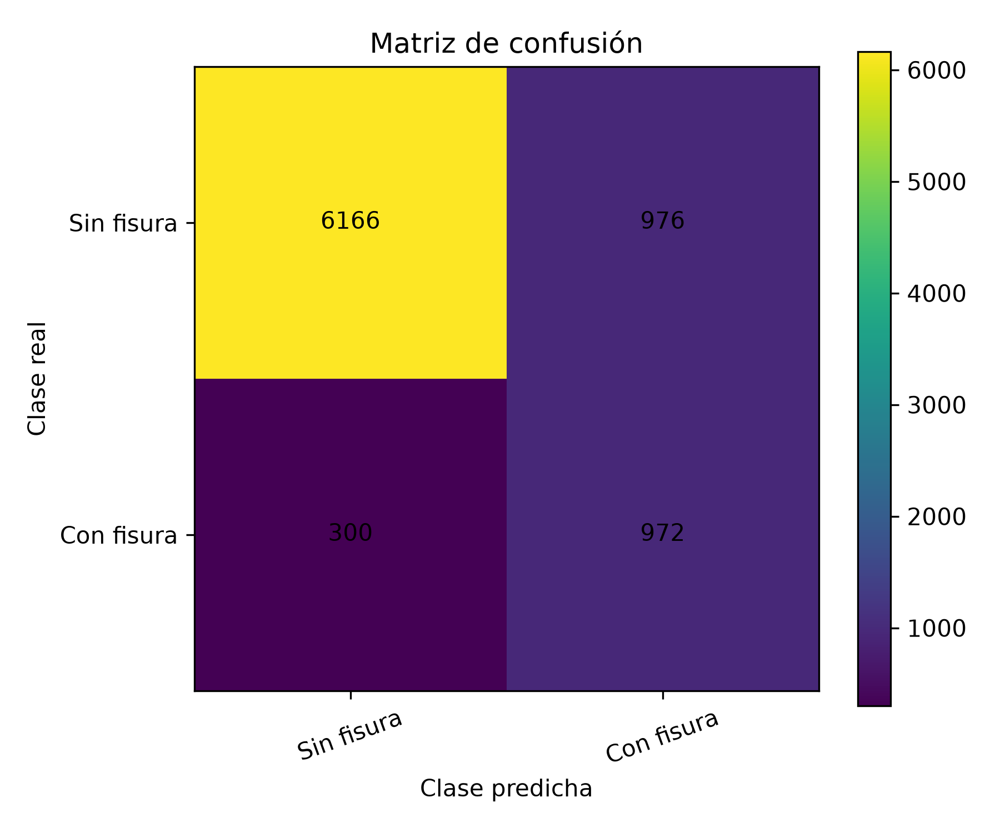
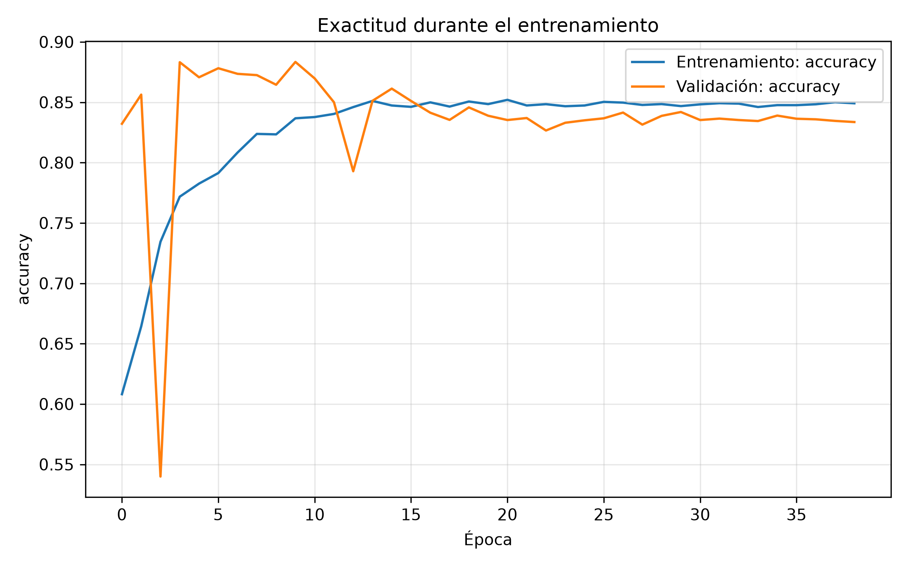
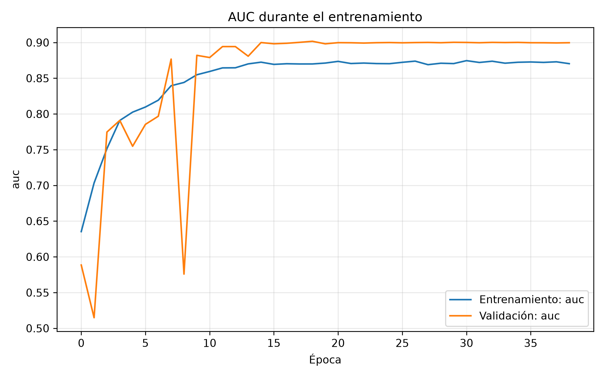
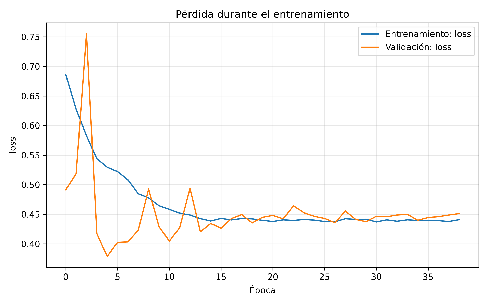
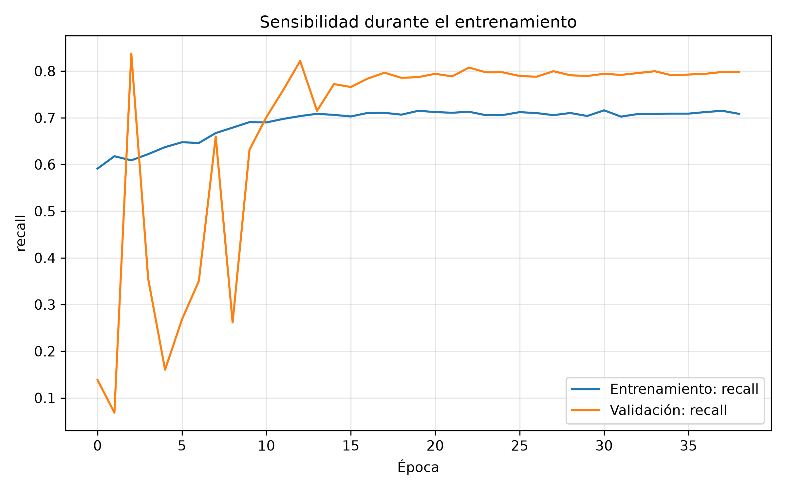
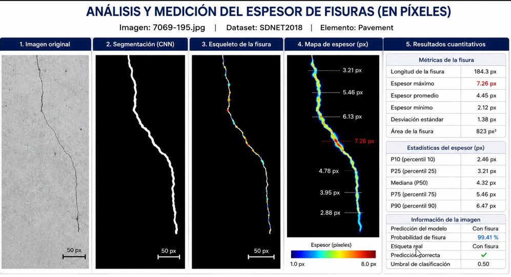
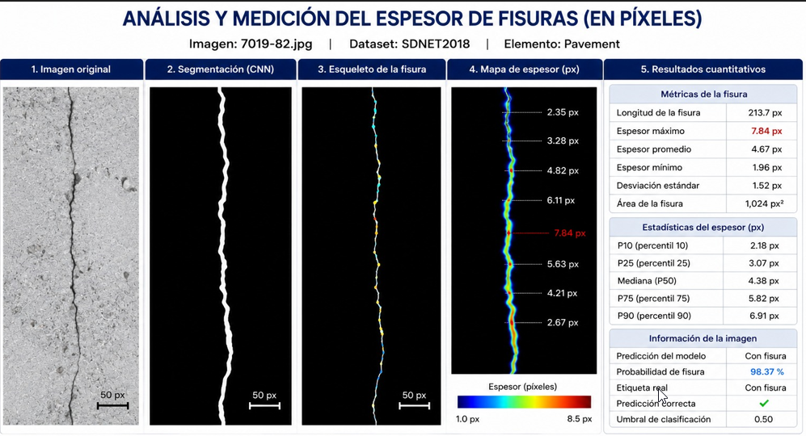

<!-- Encabezado Estilo Revista / Journal -->

  <strong>APLICACIONES DE IA EN ESTRUCTURAS</strong> &nbsp;|&nbsp; <em>UPC - TAREA 3</em>

<!-- Título Principal (Grande y Centrado) -->
<h1 align="center" style="border: none; font-size: 28px; font-weight: normal; margin-bottom: 20px;">
  Detección de Fisuras en Concreto mediante Redes Neuronales Convolucionales (CNN) y Estimación de Espesor
</h1>

 

<!-- Integrantes y Afiliación -->

  <strong>Susana Abigail Campos Rodríguez</strong> &nbsp;|&nbsp; <strong>Carlos Teodoro Barreda Guzmán</strong> 
  <em>Universidad Peruana de Ciencias Aplicadas (UPC)</em> 
  <small><code>E202524364@upc.edu.pe</code> &nbsp;|&nbsp; <code>E202524396@upc.edu.pe</code></small>

&amp;

  <strong>Jaime Jesus Ramírez Elera</strong> &nbsp;|&nbsp; <strong>Renzo Salleres Untiveros</strong> 
  <em>Universidad Peruana de Ciencias Aplicadas (UPC)</em> 
  <small><code>E202526653@upc.edu.pe</code> &nbsp;|&nbsp; <code>E202523955@upc.edu.pe</code></small>

---
> ### **Resumen (Abstract)**
> 

> La evaluación del estado de las estructuras de concreto constituye una actividad fundamental para garantizar la seguridad, la durabilidad y la funcionalidad de las edificaciones e infraestructuras civiles. Entre las patologías más frecuentes se encuentran las fisuras, las cuales pueden originarse por fenómenos de retracción, sobrecargas, acciones sísmicas, corrosión del acero de refuerzo o deterioro por agentes ambientales. La detección temprana de estas discontinuidades permite planificar intervenciones oportunas, optimizar los costos de mantenimiento y prolongar la vida útil de las estructuras. En este trabajo se desarrolla un modelo utilizando el conjunto de datos <strong>SDNET2018</strong>, <strong>TensorFlow/Keras</strong> y una <strong>CNN</strong> para la clasificación binaria de imágenes con y sin fisuras, evaluando su desempeño mediante <em>Accuracy</em>, <em>Precision</em>, <em>Recall</em>, <em>F1-Score</em> y <em>AUC</em>. Adicionalmente, se implementa un procedimiento heurístico basado en procesamiento digital de imágenes para estimar el espesor de las fisuras detectadas.
> 

> 
> **Palabras Clave (Keywords)** — *Concreto armado, Detección de fisuras, Redes Neuronales Convolucionales (CNN), Procesamiento Digital de Imágenes, SDNET2018.*

---

<h2 align="left">I. INTRODUCCIÓN</h2>

<table style="width: 100%; border-collapse: collapse; border: 1px solid #e1e4e8;">
  <tr>
    <td width="50%" valign="top" style="border: 1px solid #e1e4e8; padding: 12px 16px;">
      

        La evaluación del estado de las estructuras de concreto constituye una actividad fundamental para garantizar la seguridad, la durabilidad y la funcionalidad de las edificaciones e infraestructuras civiles. Entre las patologías más frecuentes se encuentran las fisuras, las cuales pueden originarse por fenómenos de retracción, sobrecargas, acciones sísmicas, corrosión del acero de refuerzo o deterioro ocasionado por agentes ambientales. La detección temprana de estas discontinuidades permite planificar intervenciones oportunas, optimizar los costos de mantenimiento y prolongar la vida útil de las estructuras (Watt, 2007).
      

      

        Tradicionalmente, la identificación de fisuras se realiza mediante inspecciones visuales efectuadas por especialistas. Aunque este procedimiento continúa siendo ampliamente utilizado, presenta limitaciones debido a que depende de la experiencia del inspector, requiere una considerable inversión de tiempo y puede verse afectado por la subjetividad inherente al proceso de observación. En respuesta a estas limitaciones, los avances en inteligencia artificial y visión por computadora han impulsado el desarrollo de métodos automatizados capaces de analizar imágenes digitales e identificar patrones asociados al deterioro estructural, incrementando la rapidez y objetividad de las inspecciones (Gonzalez & Woods, 2018).
      

    </td>
    <td width="50%" valign="top" style="border: 1px solid #e1e4e8; padding: 12px 16px;">
      

        Dentro de las técnicas de aprendizaje profundo, las Redes Neuronales Convolucionales (CNN) han demostrado un desempeño sobresaliente en tareas de clasificación de imágenes gracias a su capacidad para aprender automáticamente características relevantes. En este trabajo se desarrolla un modelo utilizando el conjunto de datos SDNET2018, TensorFlow/Keras y una CNN para la clasificación binaria de imágenes con y sin fisuras, evaluando su desempeño mediante <em>Accuracy</em>, <em>Precision</em>, <em>Recall</em>, <em>F1-Score</em> y <em>AUC</em> (LeCun et al., 2015; Goodfellow et al., 2016; Dorafshan et al., 2018; Abadi et al., 2016).
      

      

        Adicionalmente, se implementa un procedimiento heurístico basado en procesamiento digital de imágenes para estimar el espesor de las fisuras detectadas. Finalmente, se busca demostrar la viabilidad del empleo de herramientas de inteligencia artificial como apoyo a las inspecciones estructurales, contribuyendo al desarrollo de metodologías más objetivas, rápidas y reproducibles para la evaluación del estado de estructuras de concreto.
      

    </td>
  </tr>
</table>

 

<h2 align="left">II. METODOLOGÍA</h2>

La metodología desarrollada comprende una secuencia de etapas orientadas al desarrollo de un sistema automatizado para la detección de fisuras en concreto mediante Redes Neuronales Convolucionales (CNN) utilizando el conjunto de datos SDNET2018 obtenido de la Utah State University. El procedimiento incluye la preparación del conjunto de datos, el preprocesamiento de imágenes, el entrenamiento del modelo, la evaluación mediante métricas de clasificación y la estimación del espesor de fisuras mediante procesamiento digital de imágenes.

<table>
<tr>
<td width="50%" valign="top">

<h3 align="left"> 2.1. Selección del Conjunto de Datos</h3>

Se utilizó el dataset público SDNET2018, conformado por aproximadamente 56 000 imágenes de muros, pavimentos y losas de puente clasificadas en imágenes con fisura y sin fisura. Este repositorio destaca por su alta variabilidad en condiciones de iluminación, textura superficial y presencia de ruido en condiciones reales de obra.

 
<small><strong>Figura 1.</strong> Selección y características del conjunto de datos SDNET2018.</small>

<h3 align="left"> 2.2. Preprocesamiento de Imágenes</h3>

Se verificó la integridad de las imágenes eliminando archivos corruptos o defectuosos. Se normalizó la resolución espacial a 256×256 píxeles y se estandarizó el espacio de color en formato RGB, garantizando un dataset limpio y homogéneo para la fase de entrenamiento.

<h3 align="left"> 2.3. División del Conjunto de Datos</h3>

Se realizó una partición estratificada conservando la distribución original de clases en tres subconjuntos: 70 % para entrenamiento (39 200 imágenes), 15 % para validación (8 400 imágenes) y 15 % para prueba (8 400 imágenes).

 
<small><strong>Figura 2.</strong> Proporciones de división del conjunto de datos.</small>

 
<small><strong>Figura 3.</strong> Flujo detallado de la partición estratificada.</small>

</td>
<td width="50%" valign="top">

<h3 align="left"> 2.4. Arquitectura de la Red Neuronal (CNN)</h3>

La red propuesta incorporates cuatro bloques convolucionales secuenciales equipados con Batch Normalization, funciones de activación ReLU y submuestreo MaxPooling2D. Posteriormente, se integra una capa de agregación Global Average Pooling, regularización mediante Dropout (0.5) y una capa densa final con activación Sigmoide para la clasificación binaria (0 ≤ p ≤ 1).

 
<small><strong>Figura 4.</strong> Arquitectura de la Red Neuronal Convolucional (CNN).</small>

<h3 align="left"> 2.5. Entrenamiento del Modelo</h3>

El entrenamiento se ejecutó sobre la plataforma TensorFlow/Keras haciendo uso del optimizador Adam y un tamaño de lote (batch size) de 32 imágenes. Se aplicaron técnicas de aumento de datos (data augmentation), ponderación de clases (class_weight) para mitigar el desbalance, así como las retrollamadas EarlyStopping, ModelCheckpoint y ReduceLROnPlateau para optimizar la convergencia.

<h3 align="left"> 2.6. Evaluación del Desempeño</h3>

La capacidad predictiva del modelo fue evaluada en el conjunto de prueba independiente mediante la matriz de confusión y métricas estándar de clasificación: Accuracy, Precision, Recall, F1-Score y área bajo la curva (AUC).

<h3 align="left"> 2.7. Estimación del Espesor de Fisuras</h3>

Las imágenes clasificadas como "con fisura" son sometidas a un pipeline de procesamiento digital de imágenes: conversión a escala de grises, ecualización adaptativa de histograma (CLAHE), filtro Top-Hat/Black-Hat, umbralización de Otsu, operaciones morfológicas, esqueletización y transformada de distancia.

El sistema genera un archivo final que reporta el espesor de las fisuras en píxeles. Se destaca que la salida se presenta en píxeles debido a la ausencia de un patrón físico de escala dentro de las tomas. Aunque estudios similares sobre este dataset estiman una distancia de captura aproximada de 60 cm, la conversión a dimensiones métricas exactas requeriría una confirmación formal de los parámetros ópticos de adquisición.

</td>
</tr>
</table>

 

<h2 align="left" style="color: #24292f;">III. RESULTADOS Y DISCUSIÓN</h2>

El análisis de los resultados se estructura a partir de la evaluación cuantitativa del clasificador sobre el conjunto de prueba y la posterior interpretación geométrica de las fisuras detectadas mediante segmentación, esqueletización y mapa local de espesor en píxeles.

<!-- SECCIÓN 3.1: DESEMPEÑO GLOBAL A ANCHO COMPLETO -->
<h3 align="left" style="color: #24292f;"> 3.1. Desempeño Global del Modelo</h3>

El modelo obtuvo una exactitud global de <strong>84.83 %</strong>. La métrica ROC-AUC alcanzó <strong>89.85 %</strong>, lo que indica una adecuada capacidad de discriminación entre imágenes con y sin fisura. La sensibilidad para la clase “Con fisura” fue de <strong>76.42 %</strong>, valor relevante para tareas de inspección preventiva.

<table border="1" style="width: 100%; border-collapse: collapse; text-align: left; color: #57606a;">
  <thead>
    <tr style="background-color: #f6f8fa; color: #24292f;">
      <th style="padding: 8px;">Métrica</th>
      <th style="padding: 8px;">Resultado</th>
      <th style="padding: 8px;">Interpretación técnica</th>
    </tr>
  </thead>
  <tbody>
    <tr>
      <td style="padding: 8px;"><strong>Accuracy</strong></td>
      <td style="padding: 8px;">84.83 %</td>
      <td style="padding: 8px;">Proporción total de aciertos en el conjunto de prueba.</td>
    </tr>
    <tr>
      <td style="padding: 8px;"><strong>Precisión</strong></td>
      <td style="padding: 8px;">49.90 %</td>
      <td style="padding: 8px;">Proporción de detecciones positivas correspondientes a fisuras reales.</td>
    </tr>
    <tr>
      <td style="padding: 8px;"><strong>Recall / Sensibilidad</strong></td>
      <td style="padding: 8px;">76.42 %</td>
      <td style="padding: 8px;">Capacidad para recuperar fisuras reales; clave en inspección.</td>
    </tr>
    <tr>
      <td style="padding: 8px;"><strong>F1-Score</strong></td>
      <td style="padding: 8px;">60.37 %</td>
      <td style="padding: 8px;">Equilibrio entre precisión y sensibilidad para la clase positiva.</td>
    </tr>
    <tr>
      <td style="padding: 8px;"><strong>ROC-AUC</strong></td>
      <td style="padding: 8px;">89.85 %</td>
      <td style="padding: 8px;">Capacidad global de separación entre clases del modelo.</td>
    </tr>
  </tbody>
</table>

 

<!-- SECCIÓN 3.2: RESULTADOS POR CLASE -->
<h3 align="left" style="color: #24292f;"> 3.2. Resultados por Clase</h3>

La clase “Sin fisura” presenta una precisión elevada (95.36 %), mientras que la clase “Con fisura” alcanza una sensibilidad de 76.42 %. Esto sugiere que el modelo identifica una proporción importante de fisuras reales, existiendo margen para reducir falsos positivos.

<table border="1" style="width: 100%; border-collapse: collapse; text-align: center; color: #57606a;">
  <thead>
    <tr style="background-color: #f6f8fa; color: #24292f;">
      <th style="padding: 8px;">Clase</th>
      <th style="padding: 8px;">Precisión</th>
      <th style="padding: 8px;">Recall</th>
      <th style="padding: 8px;">F1-score</th>
      <th style="padding: 8px;">Soporte</th>
    </tr>
  </thead>
  <tbody>
    <tr>
      <td style="padding: 8px;"><strong>Sin fisura</strong></td>
      <td style="padding: 8px;">95.36 %</td>
      <td style="padding: 8px;">86.33 %</td>
      <td style="padding: 8px;">90.62 %</td>
      <td style="padding: 8px;">7,142</td>
    </tr>
    <tr>
      <td style="padding: 8px;"><strong>Con fisura</strong></td>
      <td style="padding: 8px;">49.90 %</td>
      <td style="padding: 8px;">76.42 %</td>
      <td style="padding: 8px;">60.37 %</td>
      <td style="padding: 8px;">1,272</td>
    </tr>
    <tr style="font-weight: bold; background-color: #f6f8fa;">
      <td style="padding: 8px;">Promedio ponderado</td>
      <td style="padding: 8px;">88.49 %</td>
      <td style="padding: 8px;">84.83 %</td>
      <td style="padding: 8px;">86.05 %</td>
      <td style="padding: 8px;">8,414</td>
    </tr>
  </tbody>
</table>

 

<!-- SECCIÓN 3.3: MATRIZ DE CONFUSIÓN (CONTROL DE TAMAÑO) -->
<h3 align="left" style="color: #24292f;"> 3.3. Matriz de Confusión</h3>

La matriz evidencia 6,166 verdaderos negativos y 972 verdaderos positivos. Se registran 976 falsos positivos y 300 falsos negativos. En inspección estructural, reducir los falsos negativos es prioritario para evitar omitir daños reales.

  
   
  <small style="color: #57606a;"><strong>Figura 5.</strong> Matriz de confusión en el conjunto de prueba.</small>

 

<!-- SECCIÓN 3.4: COMPORTAMIENTO DEL ENTRENAMIENTO EN MATRIZ 2X2 -->
<h3 align="left" style="color: #24292f;"> 3.4. Comportamiento durante el Entrenamiento</h3>

Las curvas de entrenamiento muestran una estabilización progresiva de las métricas. Durante las primeras épocas se observan fluctuaciones en validación, asociadas al ajuste inicial ante la clase positiva menos frecuente, logrando la convergencia en las épocas finales.

<table style="width: 100%; border: none; border-collapse: collapse;">
  <tr>
    <td width="50%" align="center" style="border: none; padding: 6px;">
      
       <small style="color: #57606a;"><strong>Figura 6.</strong> Evolución de la exactitud.</small>
    </td>
    <td width="50%" align="center" style="border: none; padding: 6px;">
      
       <small style="color: #57606a;"><strong>Figura 7.</strong> Evolución del AUC.</small>
    </td>
  </tr>
  <tr>
    <td width="50%" align="center" style="border: none; padding: 6px;">
      
       <small style="color: #57606a;"><strong>Figura 8.</strong> Evolución de la pérdida.</small>
    </td>
    <td width="50%" align="center" style="border: none; padding: 6px;">
      
       <small style="color: #57606a;"><strong>Figura 9.</strong> Evolución del Recall.</small>
    </td>
  </tr>
</table>

 

<!-- SECCIÓN 3.5: CASOS DE ESTUDIO -->
<h3 align="left" style="color: #24292f;">3.5. ANÁLISIS DE FISURAS Y MEDICIÓN DE ESPESOR</h3>

Los casos de estudio muestran el flujo de análisis completo: imagen original, segmentación, esqueleto, mapa de espesor y resultados cuantitativos. Este procedimiento permite transformar una predicción visual en indicadores geométricos objetivos.

<h4 align="left" style="color: #24292f;">Caso de Estudio 1: Muestra 7069-195</h4>

Se observa una fisura longitudinal con trayectoria irregular. El espesor máximo reportado es de <strong>7.26 px</strong>, con un espesor promedio de <strong>4.45 px</strong> y una longitud total de <strong>184.3 px</strong>. La probabilidad asignada por el modelo fue de 99.41 %.

  
   
  <small style="color: #57606a;"><strong>Figura 10.</strong> Segmentación, esqueleto y mapa de espesor para la muestra 7069-195.</small>

 

<h4 align="left" style="color: #24292f;">Caso de Estudio 2: Muestra 7019-82</h4>

Muestra una fisura continua y vertical. El espesor máximo es de <strong>7.84 px</strong>, con un promedio de <strong>4.67 px</strong> y una longitud de <strong>213.7 px</strong>. La probabilidad del modelo alcanzó el 98.37 %, reflejando un daño más extendido.

  
   
  <small style="color: #57606a;"><strong>Figura 11.</strong> Segmentación, esqueleto y mapa de espesor para la muestra 7019-82.</small>

 

 

<h3 align="left" style="color: #24292f;"> Código Fuente y Presentación de la Implementación</h3>

En esta sección se adjuntan los recursos principales correspondientes a la <strong>Tarea 3</strong>, los cuales contienen el script completo de procesamiento/medición en Python y las diapositivas de presentación del proyecto.

<table border="1" style="width: 100%; border-collapse: collapse; text-align: left; color: #57606a;">
  <thead>
    <tr style="background-color: #f6f8fa; color: #24292f;">
      <th style="padding: 10px; width: 70%;">Descripción del Recurso</th>
      <th style="padding: 10px; width: 30%; text-align: center;">Enlace / Archivo</th>
    </tr>
  </thead>
  <tbody>
    <tr>
      <td style="padding: 10px;">
        <strong>Script Principal de Python (Tarea 3)</strong> 
        <small>Contiene la arquitectura de la red convolucional, el algoritmo de segmentación, esqueletización y cálculo del espesor de fisuras.</small>
      </td>
      <td style="padding: 10px; text-align: center;">
        <a href="./T3_G1_UPC.py" style="font-weight: bold; color: #0969da;">T3_G1_UPC.py</a>
      </td>
    </tr>
    <tr>
      <td style="padding: 10px;">
        <strong>Diapositivas de la Presentación</strong> 
        <small>Presentación del Grupo 1 con la exposición de metodología, resultados y conclusiones.</small>
      </td>
      <td style="padding: 10px; text-align: center;">
        <a href="./Grupo%201-IA-UPC.pptx" style="font-weight: bold; color: #0969da;">Grupo 1-IA-UPC.pptx</a>
      </td>
    </tr>
  </tbody>
</table>

<h2 align="left" style="color: #24292f;">IV. CONCLUSIONES</h2>

<ul style="color: #57606a; line-height: 1.6; padding-left: 20px;">
  <li style="margin-bottom: 12px; text-align: justify;">
    Se desarrolló y validó exitosamente un modelo basado en <strong>Redes Neuronales Convolucionales (CNN)</strong> capaz de realizar la clasificación binaria de imágenes de pavimento en las categorías <em>“con fisura”</em> y <em>“sin fisura”</em>, alcanzando una exactitud de <strong>84.83 %</strong> y un valor de <strong>ROC-AUC de 89.85 %</strong>, lo que demuestra una adecuada capacidad de discriminación entre ambas clases.
  </li>

  <li style="margin-bottom: 12px; text-align: justify;">
    El modelo mostró una alta sensibilidad para la detección de fisuras, obteniendo un <strong>Recall de 76.42 %</strong>, lo que evidencia su capacidad para identificar una proporción importante de daños reales. Sin embargo, la precisión de <strong>49.90 %</strong> indica la presencia de falsos positivos, constituyendo una oportunidad de mejora mediante la optimización del umbral de clasificación, la incorporación de más datos de entrenamiento y el ajuste de la arquitectura del modelo.
  </li>

  <li style="margin-bottom: 12px; text-align: justify;">
    Además de la clasificación binaria, la metodología desarrollada permitió realizar el análisis cuantitativo de las fisuras, estimando parámetros geométricos como longitud y espesor mediante técnicas de segmentación, esqueletización y generación de mapas de espesor. Esto demuestra que el sistema no solo detecta la presencia de daño, sino que también proporciona información útil para apoyar procesos de evaluación y monitoreo estructural.
  </li>

  <li style="margin-bottom: 12px; text-align: justify;">
    El presente estudio demostró la viabilidad de emplear Redes Neuronales Convolucionales (CNN) como herramienta para la detección automática de fisuras en superficies de concreto, evidenciando que los modelos de aprendizaje profundo constituyen una alternativa eficiente para complementar las inspecciones visuales tradicionales. La capacidad del modelo para discriminar entre superficies fisuradas y no fisuradas confirma el potencial de la inteligencia artificial para apoyar la evaluación preliminar del estado estructural de infraestructuras civiles de manera objetiva y reproducible.
  </li>

  <li style="margin-bottom: 12px; text-align: justify;">
    La principal limitación identificada corresponde a la ausencia de un proceso de calibración geométrica durante la adquisición de las imágenes, lo que restringe la estimación del espesor de las fisuras a unidades de píxeles. En consecuencia, futuras aplicaciones orientadas al diagnóstico cuantitativo deberán incorporar patrones físicos de referencia o procedimientos de calibración que permitan expresar las mediciones en unidades métricas compatibles con los criterios de evaluación empleados en la práctica de la ingeniería estructural.
  </li>

  <li style="margin-bottom: 12px; text-align: justify;">
    Finalmente, el trabajo desarrollado confirma que la aplicación conjunta de inteligencia artificial y procesamiento digital de imágenes representa una línea de investigación con amplio potencial para la Ingeniería Civil. La incorporación futura de arquitecturas de segmentación semántica más avanzadas, modelos basados en Transformers, técnicas de aprendizaje por transferencia e integración con tecnologías como BIM, drones y sistemas de monitoreo estructural permitirá incrementar la precisión del diagnóstico, automatizar los procesos de inspección y fortalecer la implementación de estrategias de mantenimiento predictivo y gestión inteligente de activos de infraestructura.
  </li>
</ul>

 

<h3 align="left" style="color: #24292f;">REFERENCIAS</h3>

<h2 align="left" style="color: #24292f;">IV. CONCLUSIONES</h2>

<ul style="color: #57606a; line-height: 1.6; padding-left: 20px;">
  <li style="margin-bottom: 12px; text-align: justify;">
    Se desarrolló y validó exitosamente un modelo basado en <strong>Redes Neuronales Convolucionales (CNN)</strong> capaz de realizar la clasificación binaria de imágenes de pavimento en las categorías <em>“con fisura”</em> y <em>“sin fisura”</em>, alcanzando una exactitud de <strong>84.83 %</strong> y un valor de <strong>ROC-AUC de 89.85 %</strong>, lo que demuestra una adecuada capacidad de discriminación entre ambas clases.
  </li>

  <li style="margin-bottom: 12px; text-align: justify;">
    El modelo mostró una alta sensibilidad para la detección de fisuras, obteniendo un <strong>Recall de 76.42 %</strong>, lo que evidencia su capacidad para identificar una proporción importante de daños reales. Sin embargo, la precisión de <strong>49.90 %</strong> indica la presencia de falsos positivos, constituyendo una oportunidad de mejora mediante la optimización del umbral de clasificación, la incorporación de más datos de entrenamiento y el ajuste de la arquitectura del modelo.
  </li>

  <li style="margin-bottom: 12px; text-align: justify;">
    Además de la clasificación binaria, la metodología desarrollada permitió realizar el análisis cuantitativo de las fisuras, estimando parámetros geométricos como longitud y espesor mediante técnicas de segmentación, esqueletización y generación de mapas de espesor. Esto demuestra que el sistema no solo detecta la presencia de daño, sino que también proporciona información útil para apoyar procesos de evaluación y monitoreo estructural.
  </li>

  <li style="margin-bottom: 12px; text-align: justify;">
    El presente estudio demostró la viabilidad de emplear Redes Neuronales Convolucionales (CNN) como herramienta para la detección automática de fisuras en superficies de concreto, evidenciando que los modelos de aprendizaje profundo constituyen una alternativa eficiente para complementar las inspecciones visuales tradicionales. La capacidad del modelo para discriminar entre superficies fisuradas y no fisuradas confirma el potencial de la inteligencia artificial para apoyar la evaluación preliminar del estado estructural de infraestructuras civiles de manera objetiva y reproducible.
  </li>

  <li style="margin-bottom: 12px; text-align: justify;">
    La principal limitación identificada corresponde a la ausencia de un proceso de calibración geométrica durante la adquisición de las imágenes, lo que restringe la estimación del espesor de las fisuras a unidades de píxeles. En consecuencia, futuras aplicaciones orientadas al diagnóstico cuantitativo deberán incorporar patrones físicos de referencia o procedimientos de calibración que permitan expresar las mediciones en unidades métricas compatibles con los criterios de evaluación empleados en la práctica de la ingeniería estructural.
  </li>

  <li style="margin-bottom: 12px; text-align: justify;">
    Finalmente, el trabajo desarrollado confirma que la aplicación conjunta de inteligencia artificial y procesamiento digital de imágenes representa una línea de investigación con amplio potencial para la Ingeniería Civil. La incorporación futura de arquitecturas de segmentación semántica más avanzadas, modelos basados en Transformers, técnicas de aprendizaje por transferencia e integración con tecnologías como BIM, drones y sistemas de monitoreo estructural permitirá incrementar la precisión del diagnóstico, automatizar los procesos de inspección y fortalecer la implementación de estrategias de mantenimiento predictivo y gestión inteligente de activos de infraestructura.
  </li>
</ul>

 

<h3 align="left" style="color: #24292f;">REFERENCIAS</h3>

<h3 align="left">REFERENCIAS</h3>

  

    Abadi, M., et al. (2016). <em>TensorFlow: Large-Scale Machine Learning on Heterogeneous Systems</em>. <a href="https://www.tensorflow.org/">https://www.tensorflow.org/</a>
  

  

    Dorafshan, S., Thomas, R. J., & Maguire, M. (2018). SDNET2018: An annotated image dataset for non-contact concrete crack detection using deep convolutional neural networks. <em>Data in Brief</em>, 21, 1664–1668.
  

  

    Gonzalez, R. C., & Woods, R. E. (2018). <em>Digital Image Processing</em> (4th ed.). Pearson.
  

  

    Goodfellow, I., Bengio, Y., & Courville, A. (2016). <em>Deep Learning</em>. MIT Press.
  

  

    LeCun, Y., Bengio, Y., & Hinton, G. (2015). Deep learning. <em>Nature</em>, 521(7553), 436–444.
  

  

    Watt, D. (2007). <em>Building Pathology: Principles and Practice</em> (2nd ed.). Blackwell Publishing.
  

  

Yang, X., Li, H., Yu, Y., Luo, X., Huang, T., & Yang, X. (2018). Automatic Pixel-Level Crack Detection and Measurement Using Fully Convolutional Network. <em>Computer-Aided Civil and Infrastructure Engineering</em>, 33, 1090–1109.

